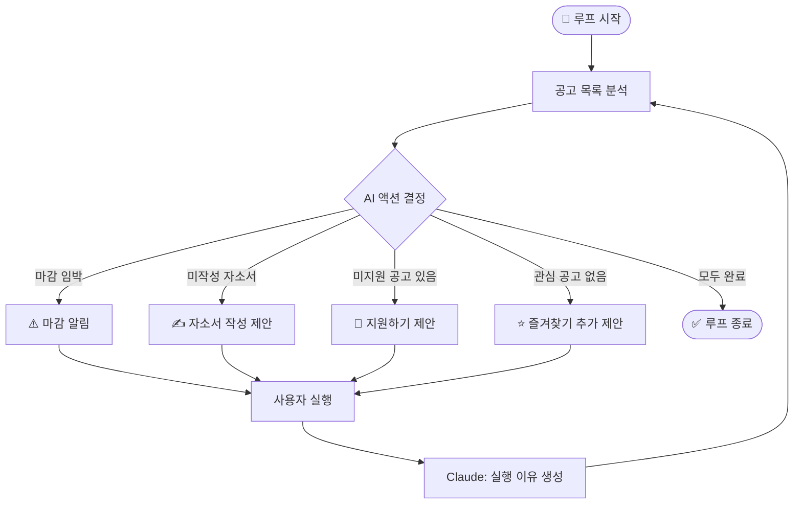
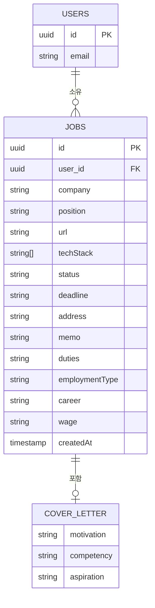
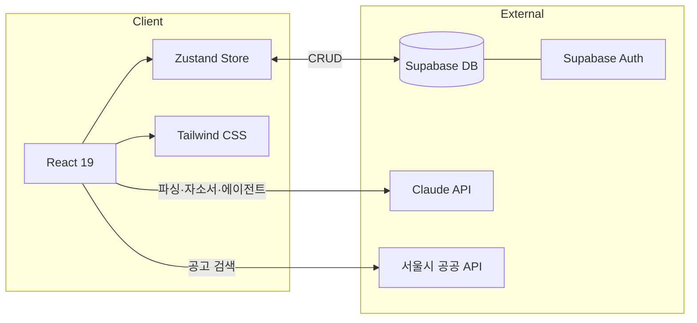

<div align="center">

# 🟢 Job Tracker Dashboard

**AI 에이전트가 다음 지원 액션을 제안하는 채용 관리 대시보드**


</div>

---

## 주요 기능

### AI 에이전트 루프
- Claude AI가 공고 목록을 분석해 **다음 지원 액션을 자동 결정**
- `지원하기 / 자소서 작성 / 마감 임박 알림 / 관심 공고 추가` 등 액션 제안
- 사용자가 실행 → AI가 결과를 보고 다음 루프 진행

### 대시보드
- 총 지원 수, 서류 합격, 최종 합격 등 **통계 카드** 한눈에 보기
- Recharts 기반 **합격률 차트** 시각화
- 마감일 디데이 표시 **캘린더**

### 공고 관리
- **테이블 뷰 / 칸반보드** 전환
- 공고 직접 입력 또는 **AI 자동 파싱** (URL → 공고 정보 자동 추출)
- 즐겨찾기 + 사이드바 고정
- 지원 상태 관리 (`관심 → 지원예정 → 지원완료 → 결과대기`)

### AI 기능 (Claude API)
- 공고 URL 파싱 → 회사명·포지션·마감일 자동 입력
- **자기소개서 초안 생성** (지원동기·역량·포부)

### 모바일 / PWA
- 하단 탭바로 모바일 최적화
- 홈 화면에 설치 가능 (PWA)

---

## AI 에이전트 루프 플로우



---

## 데이터 구조 (ERD)



---

## 아키텍처



---

## 기술 스택

| 영역 | 기술 |
|------|------|
| 번들러 | Vite 8 |
| UI | React 19 + TypeScript 6 |
| 스타일 | Tailwind CSS v3 |
| 상태관리 | Zustand |
| DB / 인증 | Supabase |
| 차트 | Recharts |
| 드래그앤드롭 | @hello-pangea/dnd |
| AI | Claude API (claude-haiku-4-5) |
| PWA | vite-plugin-pwa + Workbox |

---

## 시작하기

**1. 환경 변수 설정** — 루트에 `.env` 파일 생성

```env
VITE_CLAUDE_API_KEY=sk-ant-api03-...
VITE_SUPABASE_URL=https://xxxx.supabase.co
VITE_SUPABASE_ANON_KEY=eyJ...
```

**2. 설치 및 실행**

```bash
npm install
npm run dev
```

```bash
npm run build    # 프로덕션 빌드
npm run preview  # 빌드 결과 미리보기
```

---

## 폴더 구조

```
src/
├── api/
│   ├── claude.ts        # Claude API — 파싱·자소서·에이전트 루프
│   └── seoulJobs.ts     # 서울시 일자리 공공 API
├── components/
│   ├── auth/            # 로그인 / 게스트 화면
│   ├── dashboard/       # 통계 카드, 캘린더, 에이전트 루프
│   ├── jobs/            # 테이블, 칸반, 공고 폼, 자소서 모달
│   ├── layout/          # 헤더, 사이드바, 하단 탭바
│   └── profile/         # 프로필 모달
├── lib/
│   └── supabase.ts      # Supabase 클라이언트
├── store/
│   └── jobStore.ts      # Zustand + Supabase 동기화
├── types.ts
└── App.tsx
```

---

## 주의사항

- `.env` 파일은 절대 커밋하지 않기
- Claude API는 브라우저에서 직접 호출 (`anthropic-dangerous-direct-browser-access` 헤더)
- 게스트 모드 사용 시 데이터는 localStorage에만 저장됨
